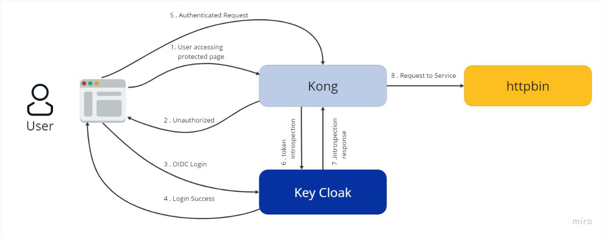
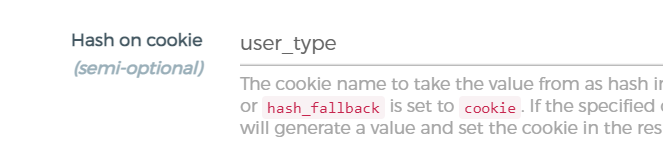


Authorization

`                     `Kong, Gateway

`                `Oauth

`    `Keycloak is an open-source identity and access management solution, while Kong Gateway is a popular open-source API gateway. OAuth is a popular authentication and authorization protocol that is often used with these technologies.     

—--------------------------------------------------------------------------------------------------------------------------------------------------------------- 
##
## **OVERVIEW**
## When using Keycloak and Kong Gateway together with OAuth, there are a few steps you can follow to enable load balancing upstream.
## Configure Keycloak as the OAuth provider: Set up Keycloak to act as the OAuth provider, so that it can handle authentication and authorization requests.
## Configure Kong Gateway: Set up Kong Gateway to use Keycloak as the OAuth provider, so that it can authenticate and authorize requests to your APIs.
## Enable load balancing: To enable load balancing, you will need to configure your Kong Gateway to use an upstream server. This will allow Kong to distribute incoming requests across multiple backend servers.
## Configure the upstream server: Configure the upstream server to handle incoming requests from Kong Gateway. This may involve setting up additional servers, load balancing, and other optimizations.
## Test and monitor: Once everything is set up, test your system to ensure that everything is working as expected. You should also monitor your system to ensure that it is performing well and that there are no issues with the load balancing or other aspects of the system.
## Overall, using Keycloak and Kong Gateway together with OAuth can provide a powerful and flexible authentication and authorization solution for your APIs. By enabling load balancing upstream, you can ensure that your system can handle large volumes of traffic and that it is highly available and performant.
##
## **Prerequisite**

Here are the requirements for using Docker Compose to set up Keycloak and Kong Gateway with OAuth and load balancing upstream:

1. Docker: You will need to have Docker installed on your local system. Docker is a platform for building, shipping, and running applications in containers.

1. Docker Compose: You will also need to have Docker Compose installed on your local system. Docker Compose is a tool for defining and running multi-container Docker applications.

1. Keycloak image: You will need to use a Keycloak Docker image that is compatible with the version of Keycloak you want to use. You can find pre-built images on Docker Hub, or you can build your own image from the Keycloak source code.

1. Kong Gateway image: You will also need to use a Kong Gateway Docker image that is compatible with the version of Kong Gateway you want to use. You can find pre-built images on Docker Hub, or you can build your own image from the Kong Gateway source code.

1. UI - git repo, Clone frontend from Github 
1. API - git repo, Clone backendfrom Github 
1. Database

##

**LOCAL SETUP** 

After up all services, you can see check docker logs, 

Here we have a frontend running in 3000 ports.

and we scale backend service into 3 ports ( 3311, 3312, 3313 )		

## **1) KEYCLOAK SETUP**
`	`Run Your Keycloak service in Local Environment.  

`	`That service will be available in PORT :  8180 

`	`Open this URL : <http://localhost:8180> in Browser 

`	`Login as admin : 

`		`Default admin login details : 

`			`1) username = admin

`			`2) password = admin

1) ### **ADD REALM**
1. Log in to Keycloak with administrative privileges.
1. Click on the "Add realm" button on the left-hand side of the screen.
1. Enter name “Experimental ”

1) ### **ADD CLIENT**

1. Enter "myapp" in the "Name" field and click on the "Create" button.

### 	
1. Enter a name for your client, such as "myapp", and select "confidential" as the client type.
1. Under the "Access" tab, set "Valid Redirect URIs" to the callback URL of your application. For example, if your application is running on localhost, you could set it to "http://localhost:3000/\*".
1. Under the "Credentials" tab, generate a new client secret and make a note of it.
1. Add Another client called Client ID = grafana, and 

` `CLient Protocol=openid-connect

1. in the next window, change Access Type to confidential

1. then click Save at the bottom. On Credentials tab, copy the secret

1. Still on grafana clients, click Mappers tab, then click create

1. Name : roles, Mapper Type : User Realm Role, Token Claim Name : roles
###
1) ### **ADD USER**
1) Enter name and email with first name.. and set Email verified as true
1) Then click save button

`	`

1) Click on Role Mapping and give basic role access to that user 

1) Go to the credentials tab and set the password.. 
1) Then click on reset password
## 
## **2) KONG SETUP**
`	`Kong with plugins for CORS, OIDC, and upstream load balancing

Here are the steps you can follow:

`	`Run Your Kong service in Local Environment.  

`	`That service will be available in PORT :  1337

`	`Open this URL : http://localhost:1337 in Browser 

`	`Login as admin : First time we have to create admin and password details.
1) ### **ADD UPSTREAM**
1) Create Upstream service name called “demo” , Hash on value “cookie”

and hash fallback “none”

1) set user define value for Hash on cookie as like “user\_type”

1) Now, click on the “Targets page” of the upstream add all backend ports. 

( 3311,3312,3313 )

1) ### **ADD SERVICE**
1) click on Services -> add new Services 
1) create name as “upstream”
1) set host as “demo” (Upstream for load balance)

1) ### **ADD PLUGINS**
we have to add two plugins in this process OIDC , CORS

1) For OIDC run this curl
1) replace client\_secret as <your client secret > 
1) client\_id as <your client id>

curl --location 'http://localhost:8001/plugins' \

--header 'Content-Type: application/x-www-form-urlencoded' \

--data-urlencode 'name=oidc' \

--data-urlencode 'config.client\_id=kong' \

--data-urlencode 'config.client\_secret=mvhPx5FgcBcjGc1hwjlM2mV1wnTrsxd8' \

--data-urlencode 'config.bearer\_only=yes' \

--data-urlencode 'config.realm=experimental' \

--data-urlencode 'config.introspection\_endpoint=http://192.168.29.92:8180/realms/experimental/protocol/openid-connect/token/introspect' \

--data-urlencode 'config.discovery=http://192.168.29.92:8180/auth/realms/experimental/.well-known/openid-configuration'

1) For cors plugin goto plugins->ADD GLOBAL PLUGINS->SECURITY
1) Now in this list, click on CORS->ADD PLUGINS
1) Then in ADD FORM set Header as Authorization, methods as GET and POST
1) Click on save changes

1) After adding both plugin, kong will display both active plugins in UI

## **3) UI**
1) ### **SETUP**
1. Clone frontend code from git -> frontend 
1. Open the root directory and run “docker build -t frontend  . “
1) ### **RUN**
1. Then Run docker image by below code “docker run -p 3000:3000 frontend”

`		`This will up frontend services in local port 3000

1) ### **TEST**
1. Note : you have to start keycloak service, otherwise frontend will show 

“This site can’t be reached”

1) ### **Config Details**
`     `**Go to -> cg\_account\_summary\_frontend\.env**

1) REACT\_APP\_KEYCLOAK\_REALM=experimental (Reals name)
1) REACT\_APP\_KEYCLOAK\_CLIENTID=myapp (Client id)
1) REACT\_APP\_KEYCLOAK\_SSO\_URL=http://192.168.29.92:8180/ 

(Keycloak Oauth URL)

1) REACT\_APP\_KEYCLOAK\_REALM=experimental (Reals name)
1) REACT\_APP\_KEYCLOAK\_CLIENTID=myapp (Client id)
1) REACT\_APP\_ACCOUNT\_SUMMARY\_API\_BASE\_URL=http://192.168.29.92:8000/

`	`(Target Kong to Resolve api and load balance )

## **4) API**
1) ### **SETUP**
1. Clone frontend code from git -> backend
1. Open the root directory and run “docker build -t backend . “
1) ### **RUN**
1. Then Run docker image by below code “docker run -p 8088:8088 backend ”

`		`This will up frontend services in local port 3000
1) ### **TEST**
`	`Download docker-compose from this link

`	`https://drive.google.com/file/d/10DaoU3nx-\_z5Bz5g22J6MZz074E5C2ZB
1) ### **Config Details**
1) DB\_HOST = "localhost" ( DB host name )
1) DB\_NAME = "demo\_db" ( DB name )
1) DB\_USER = "root" ( DB privilege User name )
1) DB\_PASSWORD = "\*\*\*\*\*\*\*" ( DB User Password )

**Integration Testing**
### **1) UI TESTING**
\1) Open http://localhost:3000

`		`2) Click Login with Keycloak

`		`3) Give username, password click on login

`		`4) After successful login, we can access produced page, using header token

\5) If We open the URL http://localhost:3000/?rsf\_id=491

### 2) **API TESTING**
\1) After all integration api will expose in local port ex:8000

`		`2) Download postman collection from below g-link 		https://drive.google.com/file/d/10DaoU3nx-\_z5Bz5g22J6MZz074E5C2ZB/view?usp=sharing

`		`3) set postman environment variables 

`		`4) Then test get,post methods 

